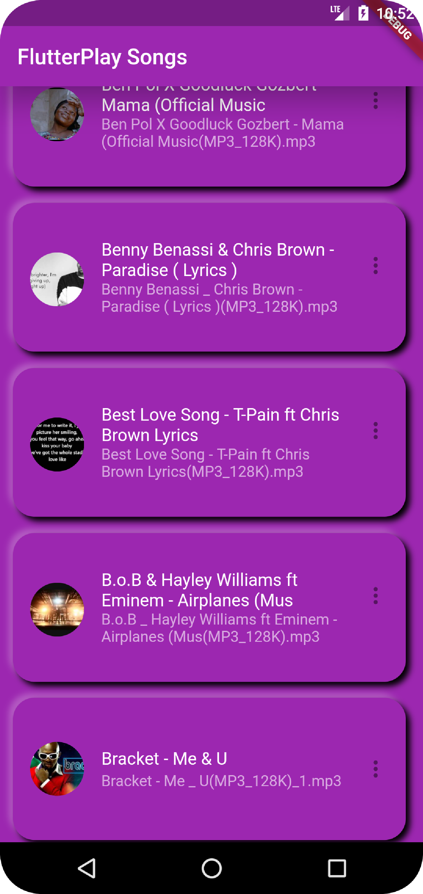
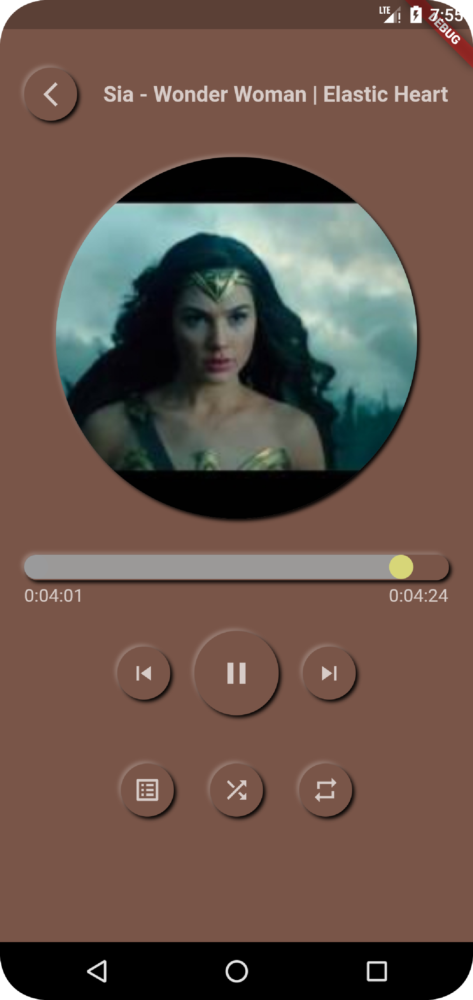
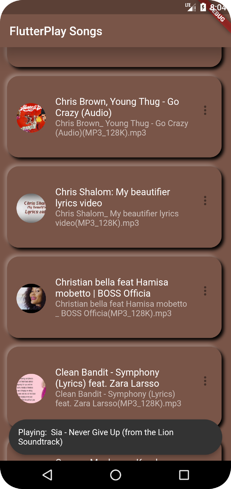

FlutterPlay, a music player app  source code 

Creating Music Player App , showing all songs of the device in listiview, Playing the songs and showing the control buttons, the playing song title, artwork, seek bar , shuffle, repeat mode, skip to next & previous, play/pause buttons, etc

These might be helpful

YT Video Tutorials

Make Music player part 1 https://youtu.be/hfi38LaYnbg

Make Music player part 2 https://youtu.be/T4yeX0uGpow

How to make a toast in flutter without using any external plugin/library https://youtu.be/kV52PO2mkYQ

